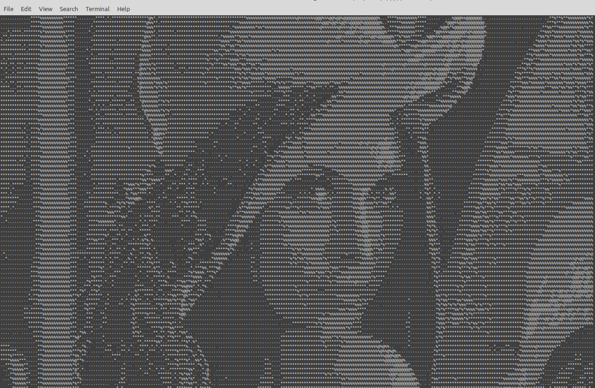

# Terminal PPM image viewer

This is a small terminal application to view PPM image format in the terminal.

_usage:_

```
$ ./build/ppmv --help
$ ./build/ppmv --path=[img path]
```

_how to build:_

```
$ make
```

_clean up build folder:_

```
$ make clean
```

_input example:_


_output example:_


